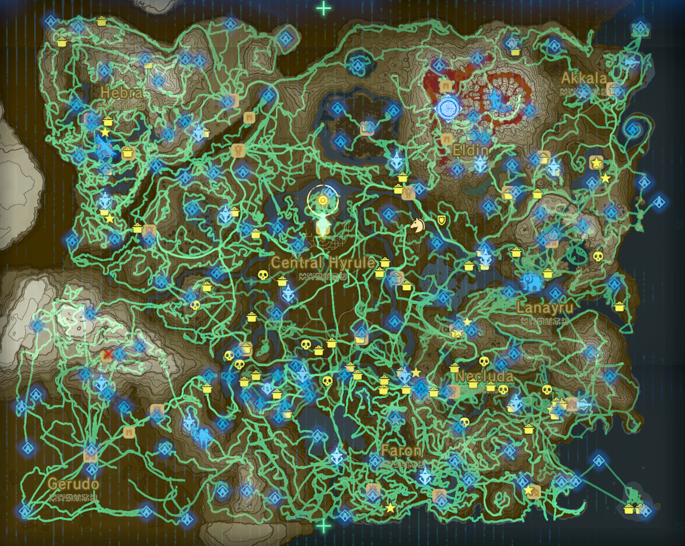

+++
title = "Consumed"
+++

This is an entry in the [Consumed](@/notes/Consumption/Consumed.md) list.

## Entry

- Type: Game
- Started: 02/08/2025
- Finished: 15/12/2025
- Playtime: 200h 14m 11s
- Platform: Nintendo Switch (emulated via [Eden](@/notes/Eden/_index.md))
- Version: USA (v1.6.0 + 2 DLCs)

## Review

Man, I wish this game had more actual content. The whole plot is just about an hour long. And I do actually appreciate them going into how dreadful Zelda's responsibility is, and how terrifying it is to actually lose everything. But there's not really much of it. The champions are forgettable, we barely know them. What became of Ganon is just shameful, the dude got degraded into a plain generic "pure evil thing", with generic elemental powers. The side quests are mostly basic fetch quests. And the rest is just... exploration.

The world is huge and beautiful, but there only so much you can do in the process before it gets repetitive. And the rewards are useless. I mean, who needs 100 rupees, or a diamond, or a weak weapon late in game? The formula of the game has changed drastically compared to previous games. The are no dungeons anymore, just a bunch of shrines with simple puzzles within. There is no logic behind why you need items anymore, you just get all of them at the start of the game. And the adventure... already happened in the past. You are just here, in the aftermath of it all, trying to find a reason to stay.

This has been a no teleportation run for the most part (except for the last few hours, I guess). I found about 400 Koroks myself, and then upped it to about 600 by following a guide, and then I gave up on finding them all (there are 900 in the game).

Obligatory Hero's Path:

