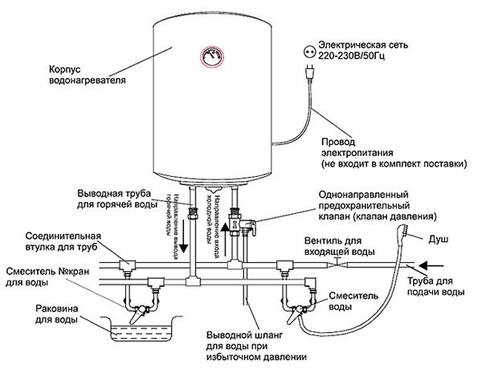
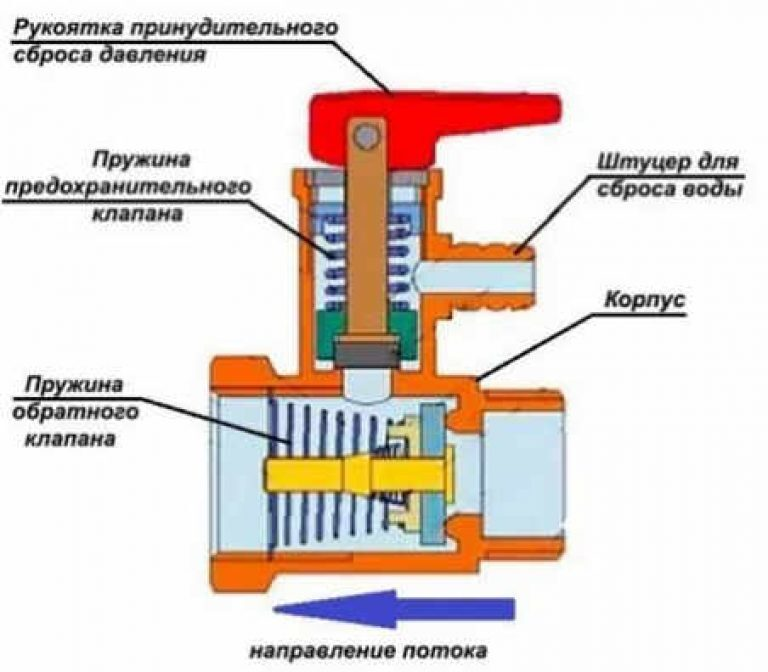

+++
title = "Водонагреватель"
+++

Водонагреватель --- устройство для непрерывного нагрева воды.

## Схемы

Пример схемы установки водонагревателя:

Пример схемы устройства предохранительного клапана:

## Предохранительный клапан

Недопустимо подключение гибкой подводки для подачи холодной воды без установки предохранительного клапана. Предохранительный клапан выполняет две важные функции:

1. Предотвращает самопроизвольный слив воды из внутреннего бака водонагревателя (в том числе и при откручивании гибкой подводки)
2. Сбрасывает избыточное давление путем сброса малого количества воды (он капает)

Если последнее вызывает проблемы, имеет смысл установить дренажную трубку с хомутом на штуцер предохранительного клапана и вывести её, например, в раковину.

## Спуск воды

Зачастую у установленного водонагревателя отсутствует сливной вентиль (это не то же самое, что предохранительный клапан). В таком случае алгоритм спуска воды следующий:

1. Перекрыть подачу холодной воды
2. Открутить гибкую подводку для подачи холодной воды с предохранительного клапана (слив остатки воды в любой резервуар)
3. Если возможно, открыть отдачу горячей воды (читай ниже)
4. Открутить гибкую подводку для отдачи горячей воды с соответствующего патрубка водонагревателя (слив остатки воды в любой резервуар)
5. Если возможно, перекрыть отдачу горячей воды (читай ниже) 
6. Открутить предохранительный клапан

При выполнении последнего шага, вода должна будет пойти из патрубка для холодной воды, однако её поток может быть крайне мал. Для усиления потока, герметично закрой патрубок горячей воды ладонью (если есть вентиль, то вентилем), а потом резко отпусти. Имеет смысл перекрыть отдачу горячей воды заранее, если возможно. 

## Ссылки

- [YouTube: Как слить воду с водонагревателя, бойлера](https://www.youtube.com/watch?v=MlFSoOHmIfM)
