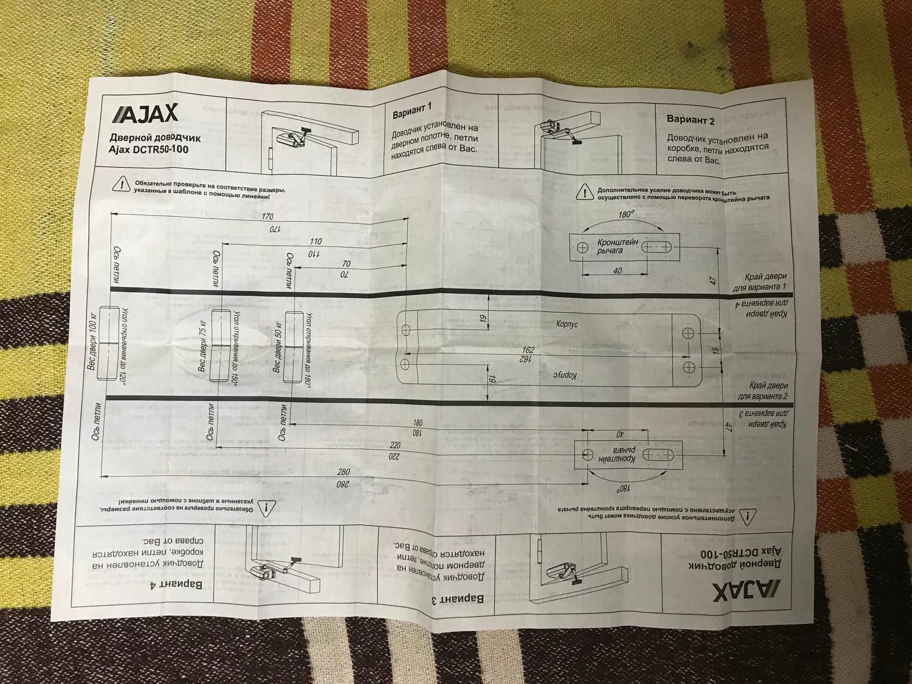
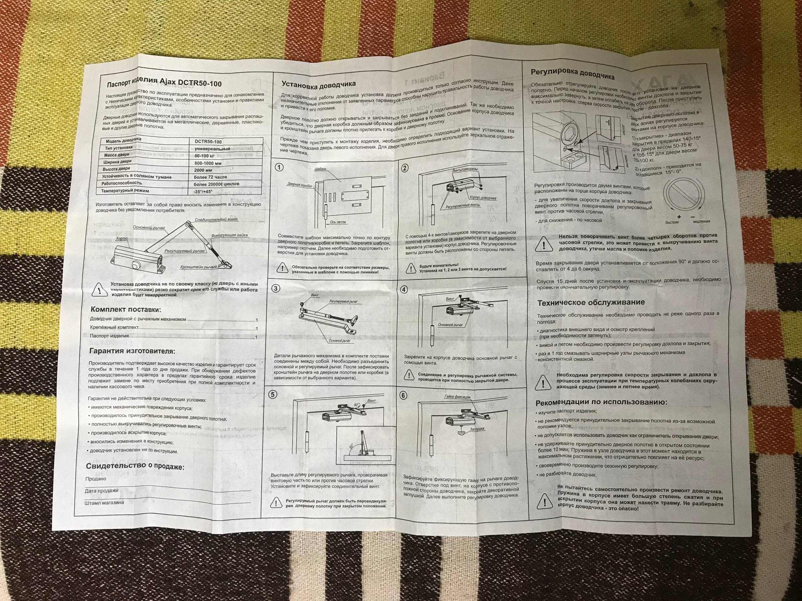

+++
title = "Доводчик"
+++

Доводчик --- это устройство для автоматического закрытия дверей.

## Установка

Доводчик может быть установлен в четырех возможных положениях:

1. Доводчик на дверном полотне, дверные петли слева, кронштейн рычага на коробке
2. Доводчик на коробке, дверные петли слева, кронштейн рычага на дверном полотне
3. Доводчик на дверном полотне, дверные петли справа, кронштейн рычага на коробке
4. Доводчик на коробке, дверные петли справа, кронштейн рычага на дверном полотне

Предпочтительно устанавливать доводчик на коробку, так как корпус доводчика значительно тяжелее кронштейна, что требует более надежного крепления. Ещё одной причиной может служить частая необходимость сверления отверстий для крепления кронштейна рычага (а их два, а не четыре).

Важно, чтобы при закрытой двери регулируемый рычаг располагался перпендикулярно дверному полотну.

Также важно, что, несмотря на общую рекомендацию устанавливать доводчик так, чтобы регулировочные винты располагались на стороне петель, следует также помнить, что важно и иметь к ним доступ для отвертки после с установки. Иногда наличие на стороне петель стены этого не позволяет.

## Регулировка

Регулировка осуществляется путем поворота двух регулировочных винтов на торце доводчика. Один для регулировки скорости закрывания двери, другой для регулировки скорости дохлопа. Важно не поворачивать регулировочный винт более четырех оборотов против часовой стрелки. Это может привести к выкручиванию винта доводчика, утечке масла и поломке изделия.

## Рекомендации

Не держите дверное полотно открытым более десяти минут при установленном доводчике. Пружина в узле доводчика находится в таком случае в максимальном растяжении, что отрицательно влияет на её ресурс.

## Пример

Шаблон для установки доводчика Ajax DCTR50-100:

Паспорт изделия Ajax DCTR50-100:

## Смотри также

- [Ремонт](@/notes/Ремонт.md)
